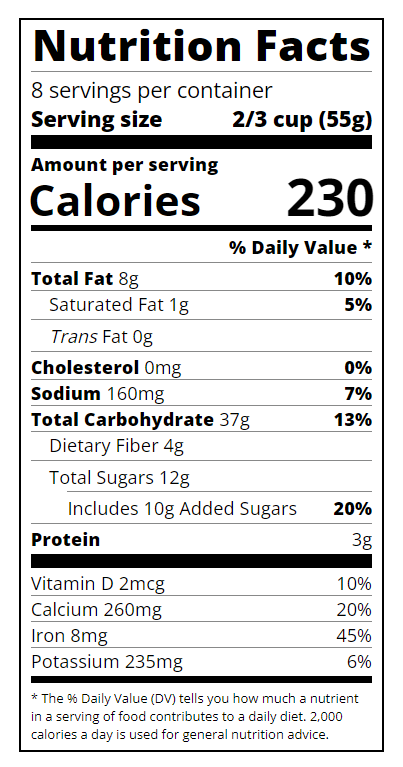

# Nutrition Label

## Description

I built this project to further my understanding of HTML and CSS. 

A nutrition label can help you make healthier eating choices and identify the nutritional value of the associated food or drink.

Things that I learned by completing this project:
- Typography
- Creating a basic Nutrition Facts label

## Usage

This is what the project should look like:

## Credits

[README Template](https://coding-boot-camp.github.io/full-stack/github/professional-readme-guide)

[Nutrition Label Coding Lesson](https://www.freecodecamp.org/learn/2022/responsive-web-design/learn-typography-by-building-a-nutrition-label/step-1)